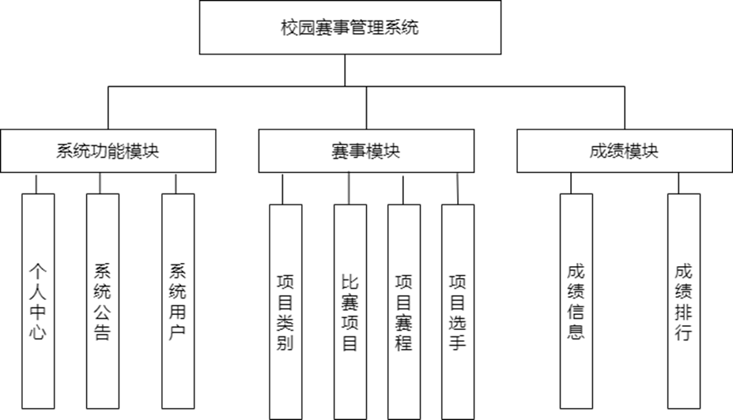
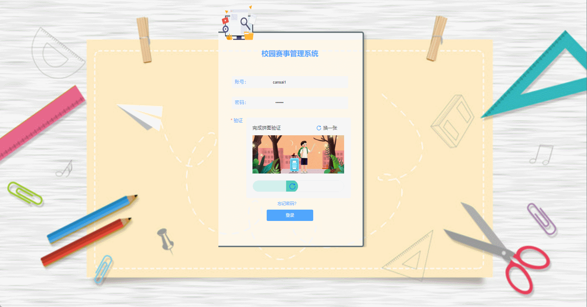
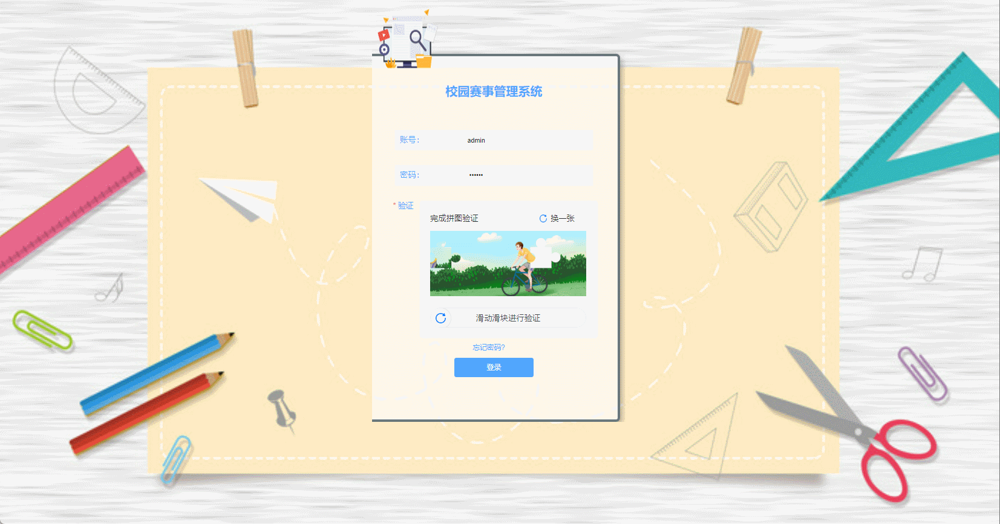

# campus_competition🎂

基于SpringBoot+Vue的校园赛事平台

## 介绍🌞

> 利用计算机技术所创建的校园赛事管理系统，能够很好的解决传统手段所不能解决的问题。首先就是效率问题，以往参加赛事都是通过老师将报名表分到各个班级，学生填写后再进行统一汇总，如果班级、学上人数众多，这将是一个及其费力且效率低下的问题。这也直接影响着赛事进度。因此一个好的校园赛事管理系统就显得尤为重要了。

## 软件架构



## 项目演示🌞

> 选手




> 赛事管理员


> 管理员



## 安装教程🌞

```
1. 运行环境准备mysql8 + java8 + node14.16.1

2. 配置maven路径，加载依赖

3. 运行sql文件，确保application.yml或config.properties的数据库名称和账号密码是数据库所在主机的账号密码
```


## 使用说明🌞

```
1. 登入

    管理员账号：admin 密码：123456

    赛事管理员账号：option1 密码：123456

    选手账号：cansai1 密码：123456
  
2. 运行流程

SpringBoot+Vue项目的部署详情可以查看这篇CSDN博客：http://t.csdnimg.cn/kpuxS

前后端不分离项目的部署流程可以查看这篇CSDN博客：http://t.csdnimg.cn/CslA5
```


## CSDN项目合集🌞

点击前往：http://t.csdnimg.cn/Q4u84


## 联系我🌞

**有偿获取完整源码或调试代码**

🐧：1902317191

微信：


